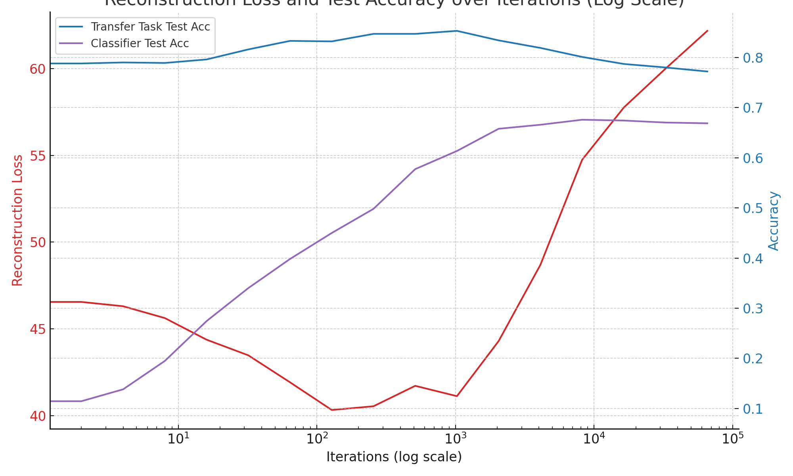

# Understanding and Leveraging the Learning Phases of Neural Networks

**Code for paper accepted at AAAI: Schneider, J., & Prabhushanka, M. (2023). Understanding and Leveraging the Learning Phases of Neural Networks: https://arxiv.org/abs/2312.06887


We train a VGG-8 network on Cifar-10 and use as transfer task computing the color dominance (R,G,B) on Cifar-100. You will see that reconstruction loss goes down and then up. You will also so that the accuracy on the transfer task increases and then decreases again. The accuracy of the original classifier just goes up.


## Citation
To cite the [Understanding and Leveraging the Learning Phases of Neural Networks](https://arxiv.org/abs/2312.06887), please use the following bibtex reference for either Arxiv or the AAAI proceedigns:


```bibtex
@article{schneider2023understanding,
  title={Understanding and Leveraging the Learning Phases of Neural Networks},
  author={Schneider, Johannes and Prabhushanka, Mohit},
  journal={arXiv preprint arXiv:2312.06887},
  year={2023}
}
```


```bibtex
@inproceedings{schneider2024understanding,
  title={Understanding and Leveraging the Learning Phases of Neural Networks},
  author={Schneider, Johannes and Prabhushanka, Mohit},
  booktitle={Proceedings of the AAAI Conference on Artificial Intelligence},
  year={2024},
  organization={AAAI}
}
```


## Installation / Quick Start

Just run "mainMet.py"

##Output
<sub><sub>
<p>Update:  Epoch, Iteration 0 0   Global Iter 0</p>
<p>{' Reconstruction loss (test data)': [46.706756591796875], '   Transfer Task Test Acc': array([0.789]), '  Train': array([0.801])}</p>
<p>Classifier Accuracy Test/Train [0.0971 0.0983]</p>
<p>---------------------------</p>
<p>Update:  Epoch, Iteration 0 2   Global Iter 2</p>
<p>{' Reconstruction loss (test data)': [46.552581787109375], '   Transfer Task Test Acc': array([0.788]), '  Train': array([0.802])}</p>
<p>Classifier Accuracy Test/Train [0.1146 0.1154]</p>
<p>---------------------------</p>
<p>Update:  Epoch, Iteration 0 4   Global Iter 4</p>
<p>{' Reconstruction loss (test data)': [46.30481719970703], '   Transfer Task Test Acc': array([0.79]), '  Train': array([0.799])}</p>
<p>Classifier Accuracy Test/Train [0.1383  0.13596]</p>
<p>---------------------------</p>
<p>Update:  Epoch, Iteration 0 8   Global Iter 8</p>
<p>{' Reconstruction loss (test data)': [45.62218475341797], '   Transfer Task Test Acc': array([0.789]), '  Train': array([0.8])}</p>
<p>Classifier Accuracy Test/Train [0.1949  0.19518]</p>
<p>---------------------------</p>
<p>Update:  Epoch, Iteration 0 16   Global Iter 16</p>
<p>{' Reconstruction loss (test data)': [44.376922607421875], '   Transfer Task Test Acc': array([0.796]), '  Train': array([0.806])}</p>
<p>Classifier Accuracy Test/Train [0.2743  0.27002]</p>
<p>---------------------------</p>
<p>Update:  Epoch, Iteration 0 32   Global Iter 32</p>
<p>{' Reconstruction loss (test data)': [43.47552490234375], '   Transfer Task Test Acc': array([0.816]), '  Train': array([0.826])}</p>
<p>Classifier Accuracy Test/Train [0.3401  0.34704]</p>
<p>---------------------------</p>
<p>Update:  Epoch, Iteration 0 64   Global Iter 64</p>
<p>{' Reconstruction loss (test data)': [41.919830322265625], '   Transfer Task Test Acc': array([0.833]), '  Train': array([0.84])}</p>
<p>Classifier Accuracy Test/Train [0.3982  0.40782]</p>
<p>---------------------------</p>
<p>Update:  Epoch, Iteration 0 128   Global Iter 128</p>
<p>{' Reconstruction loss (test data)': [40.32390594482422], '   Transfer Task Test Acc': array([0.832]), '  Train': array([0.845])}</p>
<p>Classifier Accuracy Test/Train [0.45    0.47524]</p>
<p>---------------------------</p>
<p>Update:  Epoch, Iteration 0 256   Global Iter 256</p>
<p>{' Reconstruction loss (test data)': [40.539127349853516], '   Transfer Task Test Acc': array([0.847]), '  Train': array([0.855])}</p>
<p>Classifier Accuracy Test/Train [0.4981 0.5263]</p>
<p>---------------------------</p>
<p>Update:  Epoch, Iteration 1 121   Global Iter 512</p>
<p>{' Reconstruction loss (test data)': [41.71675491333008], '   Transfer Task Test Acc': array([0.847]), '  Train': array([0.856])}</p>
<p>Classifier Accuracy Test/Train [0.5773  0.62976]</p>
<p>---------------------------</p>
<p>Update:  Epoch, Iteration 2 242   Global Iter 1024</p>
<p>{' Reconstruction loss (test data)': [41.12074279785156], '   Transfer Task Test Acc': array([0.853]), '  Train': array([0.861])}</p>
<p>Classifier Accuracy Test/Train [0.6135  0.71832]</p>
<p>---------------------------</p>
<p>Update:  Epoch, Iteration 5 93   Global Iter 2048</p>
<p>{' Reconstruction loss (test data)': [44.299110412597656], '   Transfer Task Test Acc': array([0.834]), '  Train': array([0.842])}</p>
<p>Classifier Accuracy Test/Train [0.6578  0.86204]</p>
<p>---------------------------</p>
<p>Update:  Epoch, Iteration 10 186   Global Iter 4096</p>
<p>{' Reconstruction loss (test data)': [48.69013214111328], '   Transfer Task Test Acc': array([0.819]), '  Train': array([0.831])}</p>
<p>Classifier Accuracy Test/Train [0.6658 0.9889]</p>
<p>---------------------------</p>
<p>Update:  Epoch, Iteration 20 372   Global Iter 8192</p>
<p>{' Reconstruction loss (test data)': [54.7445182800293], '   Transfer Task Test Acc': array([0.801]), '  Train': array([0.808])}</p>
<p>Classifier Accuracy Test/Train [0.6758 1.    ]</p>
<p>---------------------------</p>
<p>Update:  Epoch, Iteration 41 353   Global Iter 16384</p>
<p>{' Reconstruction loss (test data)': [57.76188659667969], '   Transfer Task Test Acc': array([0.787]), '  Train': array([0.796])}</p>
<p>Classifier Accuracy Test/Train [0.6742 1.    ]</p>
<p>---------------------------</p>
<p>Update:  Epoch, Iteration 83 315   Global Iter 32768</p>
<p>{' Reconstruction loss (test data)': [60.00288391113281], '   Transfer Task Test Acc': array([0.78]), '  Train': array([0.789])}</p>
<p>Classifier Accuracy Test/Train [0.6702 1.    ]</p>
<p>---------------------------</p>
<p>Update:  Epoch, Iteration 167 239   Global Iter 65536</p>
<p>{' Reconstruction loss (test data)': [62.17872619628906], '   Transfer Task Test Acc': array([0.772]), '  Train': array([0.782])}</p>
<p>Classifier Accuracy Test/Train [0.6687 1.    ]</p>
</sub> </sub>



